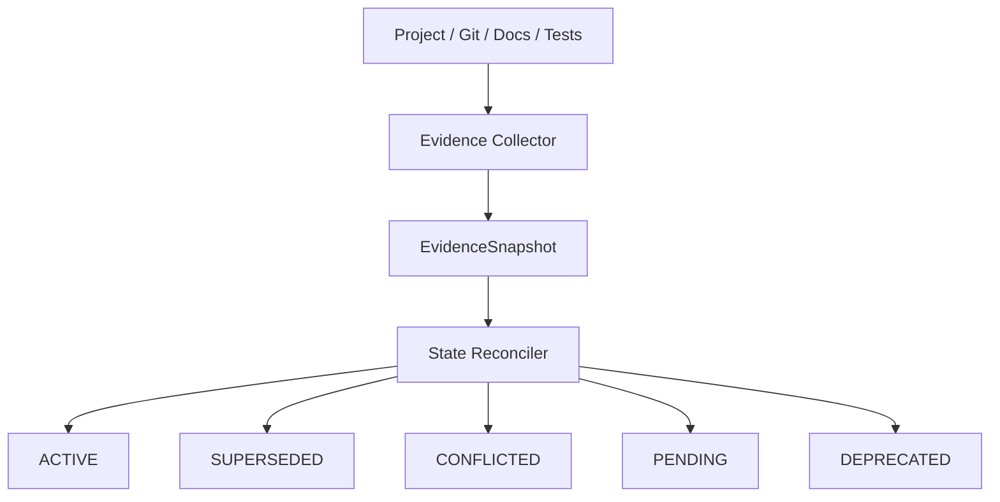

# Agent Memory OS

Persistent, auditable project state for long-running coding-agent workflows.

**Status: Alpha / Work in Progress**

Coding agents often lose important project state across sessions. Current state
can become stale, historical decisions can conflict, and future plans can be
mistaken for completed facts. Project continuity is different from chat
history: it needs evidence, provenance, explicit reconciliation, and clear
authority boundaries.

## Capability status

### Implemented

- Evidence Collector
- Read-only Shadow Project Policy
- State Reconciler

### In progress

- Current State Model

### Planned

- Context Compiler
- Authority Gate
- Checkpoint Writer
- Eval Harness
- Dashboard

## Implemented pipeline



The collector records deterministic, provenance-preserving observations. A
recorded test result found in project documentation is labeled
`recorded_not_executed`; it is never presented as a fresh test run. The
reconciler classifies structured candidates using deterministic rules and
produces stable JSON for fixed inputs and a fixed clock.

The planned pipeline continues from the reconciled facts:

```text
Current State Model -> Context Compiler -> Authority Gate
                    -> Checkpoint Writer -> Eval -> Dashboard
```

See [architecture](docs/architecture.md) and
[state reconciliation](docs/state-reconciliation.md) for details.

## Memory is not authority.

A system knowing project context does not imply permission to modify the
project. In a synthetic memory-onboarding task, reading, analyzing, and
indexing context may be allowed while changing business code, changing tests,
or running destructive Git operations remains unauthorized. An explicit
Authority Gate is planned; this alpha is not itself a security sandbox.

## Shadow safety contract

The implemented default policy is:

```text
READ        = ALLOW
ANALYZE     = ALLOW
WRITE       = DENY
DESTRUCTIVE = DENY
```

The collector uses constrained Git argument templates, `shell=False`, bounded
file discovery, and pre/post integrity measurements. A successful collection
ends with `SHADOW_COLLECTION_PASS`; detected mutation produces a safety failure
and no final artifact. Discovered project tests and package scripts are parsed,
not executed.

## Install and verify

Agent Memory OS requires Python 3.11 or newer. Runtime code uses the standard
library; pytest is the test-only dependency.

```powershell
py -3.11 -m pip install --no-deps -e .
py -3.11 -m pytest
```

The tests use only synthetic or temporary projects. They do not require a
network connection, API key, external memory service, or local private data.

## Collector example

```powershell
py -3.11 -m agent_memory_os.evidence.collector `
  --project 'C:\Users\demo\projects\interview-agent-finals' `
  --project-id synthetic-interview-agent `
  --output '.\artifacts\synthetic-evidence.json'
```

Runtime artifacts are intentionally ignored by Git. The reviewed example in
[`examples/sanitized-interview-agent`](examples/sanitized-interview-agent/README.md)
is fully synthetic and demonstrates reconciliation without accessing a real
project.

## Scope

This alpha targets local and personal coding-agent workflows. It does not write
memory automatically, does not grant execution authority, and does not include
the Current State Model or later planned modules. Read
[limitations](docs/limitations.md) before adopting it and see the
[roadmap](docs/roadmap.md) for planned phases.
