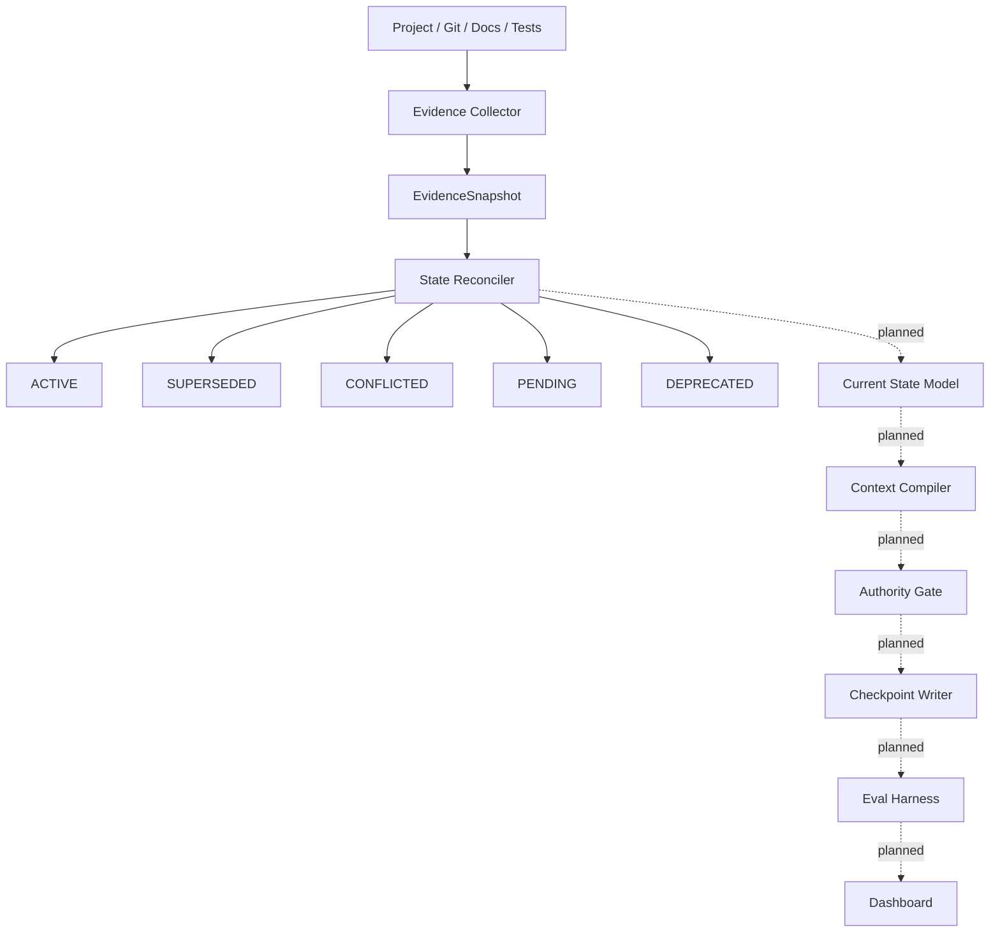

# Architecture

Agent Memory OS separates observation, reconciliation, state compilation, and
authority. The alpha implements the first two stages and keeps every later
stage explicit as planned work.

## Evidence Collector

The collector observes a project through filesystem, Git, documentation, and
test-discovery adapters. Evidence values distinguish `known`, `unknown`, and
`unavailable` and carry field-level provenance. Output is deterministic JSON.

## Shadow mode

Shadow mode permits read and analysis operations while denying writes and
destructive actions. Git execution uses an argument allowlist and a scrubbed
environment. Four pre/post measurements cover HEAD, index bytes, exact status,
and tracked file content. The collector reports a violation instead of trying
to repair a changed project.

## State Reconciler

The reconciler consumes an immutable evidence snapshot, memory candidates, a
policy, and an injected clock. It performs temporal assessment, precedence and
lineage resolution, relation construction, and invariant validation. Its core
does not perform filesystem, process, network, model, or memory-service I/O.

## Future pipeline

The Current State Model will expose a compact view over reconciled facts. Later
phases will compile context, check authority before action, write controlled
checkpoints, evaluate continuity, and visualize results. These components are
not implemented in this alpha.
